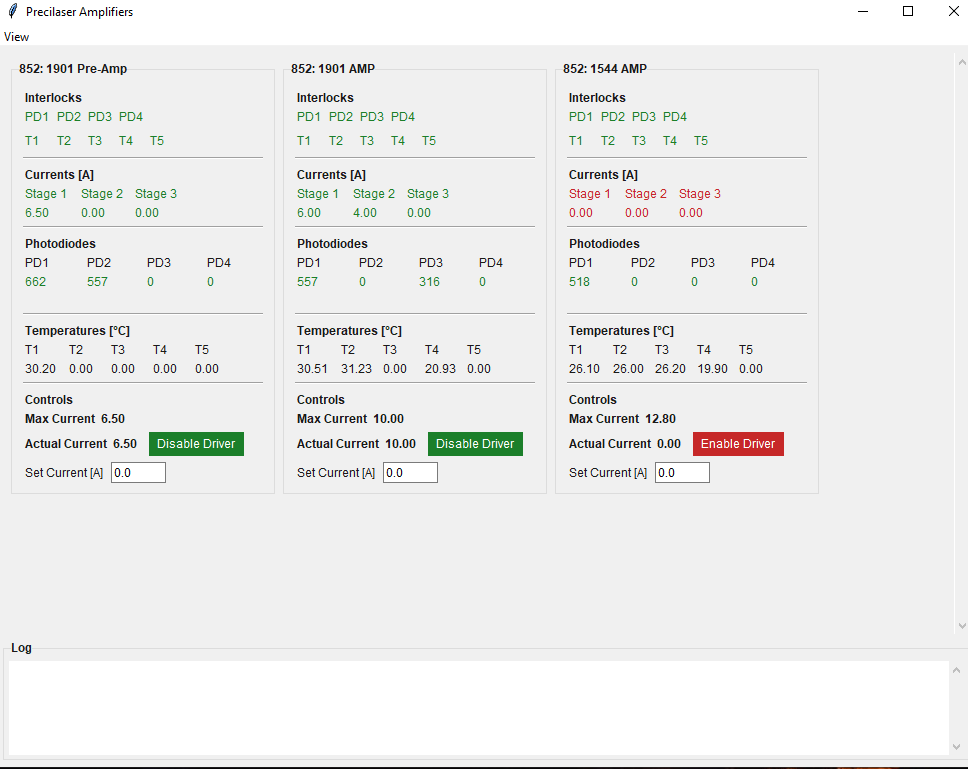

# Precilaser Amplifier GUI

Live status and control for Precilaser amplifiers (`GUI.py`). Configure ports in `devices.json`, then run:

```powershell
py -3 GUI.py
```

Requires Python 3, `pyserial`, and Tkinter.



Each card shows interlocks (PD/T), stage currents, photodiodes, temperatures, and controls (enable/disable drivers, max/actual current, target current). Enter a target and press **Enter** to ramp. Optional card border color and max-current cap come from `devices.json`.

## devices.json

| Field | Required | Description |
|-------|----------|-------------|
| `name` | yes | Display name on the card |
| `port` | yes | Serial port (e.g. `COM9`) |
| `current drivers` | no | Drivers used (1–3, default **3**). Unused stages greyed out |
| `color` | no | Hex color for the card border (`#RGB` / `#RRGGBB`) |
| `max current` | no | Caps Set Current; shown as **—** if omitted |

## Safety features

### Connection
- No status for **3 s** → card marked disconnected; controls disabled
- Failed ports retry automatically; cards stay visible but greyed out

### Current changes (always ramp)
Current is never jumped in one step. Enter a target and press **Enter** to ramp:

- **0.5 A** steps, **1 s** apart
- Values above `max current` (if set) are capped
- Blocked unless **all configured drivers** are enabled
- Blocked if any **PD/T interlock** is faulted
- Re-checked **before every step**; ramp aborts if drivers drop or an interlock faults
- Only one ramp per amplifier at a time

### Disable Driver
- If current ≈ 0 → disable immediately
- If current > 0 → **ramp to 0 A** first, then disable only when near zero
- If the ramp-to-zero fails (interlock / drivers), drivers stay enabled

### Enable Driver
- Enables only the stages in `current drivers` (mask `0x01` / `0x03` / `0x07`); does not change current
- Button is **green** when all configured drivers report enabled, otherwise **red**

### Other
- Commands spaced ≥ **~250 ms** (protocol requires ≥ 200 ms)
- Interlocks, PD trips, and stage colors show faults from live status (not button state)
- Does **not** replace hardware interlocks or manufacturer startup/shutdown procedure
